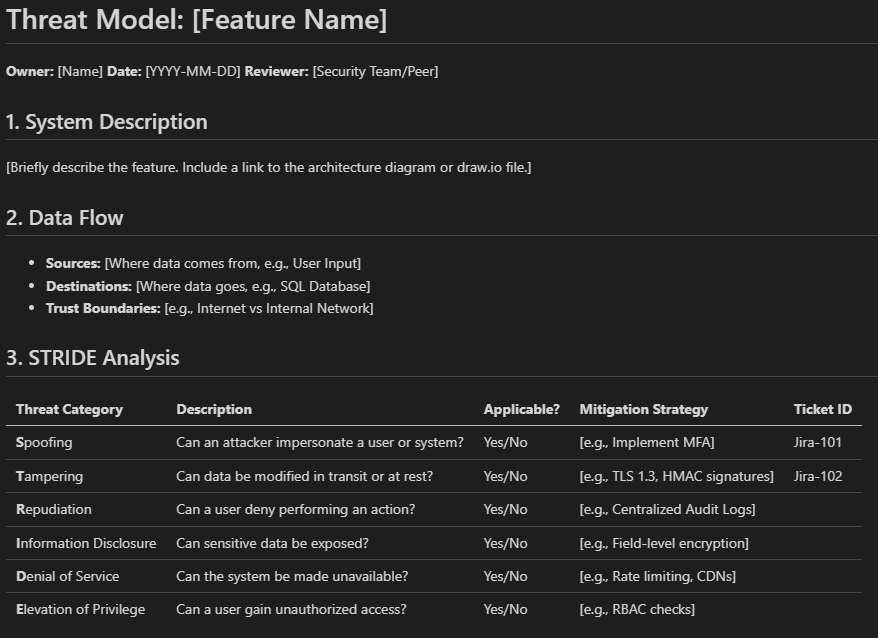

# Threat Modeling Templates for Product Security


Reusable **STRIDE** and **PASTA** threat modeling templates for Agile product teams. This repository standardizes security requirements for Product Managers, DevOps Engineers, and Security Architects.

## What it does
This toolkit provides structured Markdown and draw.io compatible templates. It simplifies the security design review process. You can use these templates to document assets, identify threats, and propose mitigations directly in your version control system.

## Who it is for
- **Security Champions** seeking standardized reporting.
- **Product Owners** integrating security stories into backlogs.
- **SREs** reviewing infrastructure risks.

## Install
You can clone the repository to access the templates locally.

```bash
git clone https://github.com/obsTR/threat-modeling-templates-product-security.git
```

## Usage
1. Copy the file `templates/STRIDE_assessment.md` into your project's `docs/` or `design/` folder.
2. Rename the file to match your feature (e.g., `payment_gateway_threat_model.md`).
3. Commit the file to your repository.
4. Fill out the Asset Identification section during your design phase.

## Examples
Use these completed examples as starting points for your own threat models:

- `examples/ecommerce_login_stride.md` - Authentication flow (STRIDE)
- `examples/ecommerce_checkout_stride.md` - Checkout and payments (STRIDE)
- `examples/internal_admin_portal_stride.md` - Internal admin operations (STRIDE)
- `examples/public_rest_api_stride.md` - Partner API surface (STRIDE)
- `examples/kubernetes_workload_stride.md` - CI/CD to Kubernetes (STRIDE)
- `examples/mobile_auth_pasta.md` - Mobile auth risk analysis (PASTA)
- `examples/cloud_storage_pasta.md` - File storage and sharing (PASTA)

## Visual Preview



## Limitations
- Requires manual updating as architecture changes.
- Does not replace automated SAST/DAST scanning tools.

## Roadmap
- [ ] Add LINDDUN privacy engineering templates.
- [ ] Create a CLI tool to generate PDF reports from Markdown.
- [ ] Add integration support for Jira tickets.

## License
Distributed under the MIT License. See `LICENSE` for more information.
